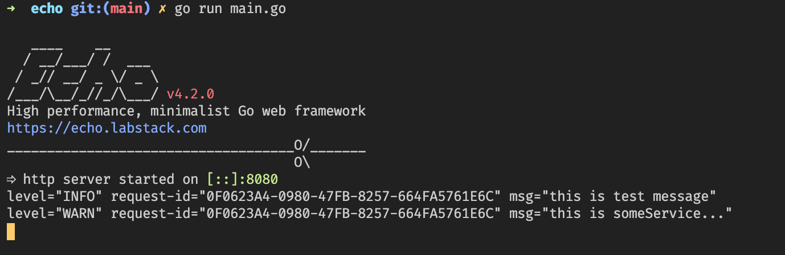
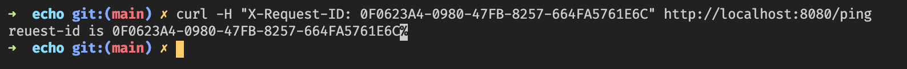

# klog
klog is a structured logger for Go (golang), completely API compatible with the standard library logger.

It can be introduced into the project easily, quickly and lightly. Inspired by [Logrus](https://github.com/sirupsen/logrus)

# Fully compatible with the Golang log library, it is easy to replace the official log package

Example:

    package main

    import (
        log "github.com/kunstack/klog"
        "os"
    )

    func main() {
        log.Println("this is test string")
        log.Printf("%d this is a test number",22222)
        log.Panic("oh ! panic happen")
    }

# Examples

    package main

    import (
        log "github.com/kunstack/klog"
        "os"
    )

    func main() {
        // Create a new logger
        logger := log.New(os.Stderr, log.AddLevel(log.TraceLevel))

        // Print a debug log
        logger.Debug("This is debug msg (Debug)")
        logger.Debugln("This is debug msg (Debugln) ")
        logger.Debugf("This is debug number %d", 2233)

        // Print a log log, level `INFO`
        logger.Info("this is Info msg (Info)")
        logger.Infoln("this is Info msg (Infoln)")
        logger.Infof("%s %d","this is a Info number")

        // Print a log, log level `WARN`
        logger.Warn("...")
        logger.Warnln("...")
        logger.Warnf("...")

        // print a log , log level `ERROR`
        logger.Error("...")
        logger.Errorln("...")
        logger.Errorf("...")

        // Log and throw a panic  log level `PANIC` 
        logger.Panic("...")
        logger.Patnicln("...")
        logger.Patnicf("...")

        // Print the error log and exit the  program, log level  `ERROR`
        logger.Fatal("...")
        logger.Fataln("...")
        logger.Fatalf("...")
    }

# Modify the default log output

The log is output to `os.Stderr` by default. You can use SetOutput to modify the default output object.

    package main

    import (
            "os"

            log "github.com/kunstack/klog"
    )

    func main() {
            outFile, err := os.OpenFile("log.txt", os.O_WRONLY|os.O_CREATE|os.O_APPEND, 0644)
            if err != nil {
                    log.Fatal(err.Error())
            }

            log.SetLevel(log.DebugLevel)   //Set the default log display level. If you do not set all levels of logs, they will be output and the log level will not be displayed (in order to be consistent with the official log package)

            // Modify the default log output object
            log.SetOutput(outFile)

            log.Info("xxx")
    }

# example for echo

In some systems, the gateway (such as [ingress-nginx](https://kubernetes.github.io/ingress-nginx/user-guide/nginx-configuration/configmap/#generate-request-id)) will send a The http header field of X-Request-ID, we hope that each line of the log printed by processing the request can print the x-request-id field together.
The following example is the best practice for using klog with the gin framework.We choose to read the X-Request-ID field in the middleware and ensure that the request-id field can be obtained normally in subsequent functions.

    package main

    import (
        "context"
        "fmt"
        "net/http"

        log "github.com/kunstack/klog"
        "github.com/labstack/echo/v4"
    )

    // Do some operations...
    func someService(ctx context.Context) {
        l := log.FromContext(ctx)
        defer l.Flush()
        l.Warningln("this is someService...")
    }

    // curl -H "X-Request-ID: 0F0623A4-0980-47FB-8257-664FA5761E6C" http://localhost:8080/ping

    func main() {
        app := echo.New()
        app.Use(
            func(next echo.HandlerFunc) echo.HandlerFunc {
                return func(ctx echo.Context) error {
                    newCtx := log.WithContext(
                        ctx.Request().Context(),
                        log.StrField("request-id", ctx.Request().Header.Get("x-request-id")),
                    )
                    ctx.SetRequest(ctx.Request().WithContext(newCtx))
                    return next(ctx)
                }
            },
        )

        app.GET("/ping", func(ctx echo.Context) error {
            l := log.FromContext(ctx.Request().Context())
            defer l.Flush()
            l.Infoln("this is test message")
            someService(ctx.Request().Context())
            return ctx.String(http.StatusOK, fmt.Sprintf("reuest-id is %s", l.Fields().Get("request-id")))
        })
        app.Start(":8080")
    }

Some gateways will help us generate X-Request-ID, if you need to test manually, you can try the following curl command

    curl -H "X-Request-ID: 0F0623A4-0980-47FB-8257-664FA5761E6C" http://localhost:8080/ping

operation result,The corresponding request-id printed in each log line:

The result of running the curl command

# example for gin

In some systems, the gateway (such as [ingress-nginx](https://kubernetes.github.io/ingress-nginx/user-guide/nginx-configuration/configmap/#generate-request-id)) will send a The http header field of X-Request-ID, we hope that each line of the log printed by processing the request can print the x-request-id field together.
The following example is the best practice for using klog with the gin framework.We choose to read the X-Request-ID field in the middleware and ensure that the request-id field can be obtained normally in subsequent functions.

    package main

    import (
        "context"
        "fmt"
        "net/http"

        "github.com/gin-gonic/gin"
        log "github.com/kunstack/klog"
    )

    // Do some operations...
    func someService(ctx context.Context) {
        l := log.FromContext(ctx)
        defer l.Flush()
        l.Warningln("this is someService...")
    }

    func main() {
        router := gin.Default()

        router.Use(func(ctx *gin.Context) {
            newCtx := log.WithContext(
                ctx.Request.Context(),
                log.StrField("request-id", ctx.Request.Header.Get("x-request-id")),
            )
            ctx.Request = ctx.Request.WithContext(newCtx)
        })

        router.GET("/ping", func(ctx *gin.Context) {
            l := log.FromContext(ctx.Request.Context())
            defer l.Flush()
            l.Infoln("this is test message")
            someService(ctx.Request.Context())
            ctx.String(http.StatusOK, fmt.Sprintf("reuest-id is %s", l.Fields().Get("request-id")))
        })

        router.Run(":8080")
    }

Some gateways will help us generate X-Request-ID, if you need to test manually, you can try the following curl command

    curl -H "X-Request-ID: 0F0623A4-0980-47FB-8257-664FA5761E6C" http://localhost:8080/ping

operation result,The corresponding request-id printed in each log line:

The result of running the curl command

Log rotation example:

    package main

    import (
        "os"
        "os/signal"
        "sync"
        "syscall"
        "time"

        log "github.com/kunstack/klog"
    )

    var onlyOneSignalHandler = make(chan struct{})
    var shutdownHandler chan os.Signal
    var shutdownSignals = []os.Signal{os.Interrupt, syscall.SIGTERM}

    // SetupSignalHandler registered for SIGTERM and SIGINT. A stop channel is returned
    // which is closed on one of these signals. If a second signal is caught, the program
    // is terminated with exit code 1.
    func setupSignalHandler() <-chan struct{} {
        close(onlyOneSignalHandler) // panics when called twice

        shutdownHandler = make(chan os.Signal, 2)

        stopChan := make(chan struct{})

        signal.Notify(shutdownHandler, shutdownSignals...)
        go func() {
            <-shutdownHandler
            close(stopChan)
            <-shutdownHandler
            os.Exit(1) // second signal. Exit directly.
        }()

        return stopChan
    }

    func main() {
        log.SetLevel(log.DebugLevel) // set log level to debug
        defer log.Flush()            // flush all buffer before exit

        file, err := os.OpenFile("./logrotate.log", os.O_WRONLY|os.O_APPEND|os.O_CREATE, 0644)
        if err != nil {
            log.Fatalln(err)
        }
        log.SetOutput(file) //Initialize the log file

        stopChan := setupSignalHandler()

        rotateHandler := make(chan os.Signal)
        signal.Notify(rotateHandler, syscall.SIGUSR1) // log rotate signal,  kill -SIGUSR1 $pid

        wg := sync.WaitGroup{}
        wg.Add(1)
        go func() {
            defer wg.Done()
            for {
                select {
                case <-rotateHandler:
                    log.SetOutput(os.Stderr) // Temporarily set to os.Stderr
                    if err := file.Close(); err != nil {
                        log.Errorln(err)
                        break
                    }
                    file, err = os.OpenFile("./logrotate.log", os.O_WRONLY|os.O_APPEND|os.O_CREATE, 0644)
                    if err != nil {
                        log.Errorln(err)
                        break
                    }
                    log.SetOutput(file)
                    log.Debugln("Log rotate was successful")
                case <-stopChan: //Receive stop signal e.g. ctl+c
                    close(rotateHandler)
                    return
                }
            }
        }()

        wg.Add(1)
        go func() { // output log
            defer wg.Done()
            for i := 0; ; i++ {
                time.Sleep(time.Second)
                log.Debugf("this is This is the %dth cycle", i)
                select {
                case <-stopChan:
                    return
                default:
                }
            }
        }()

        wg.Wait()
    }

