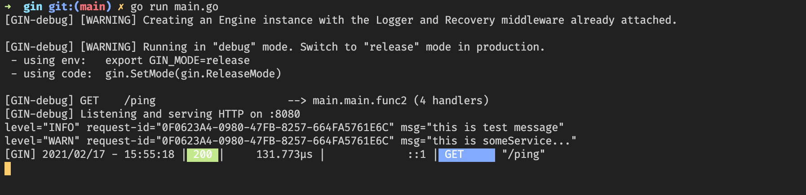
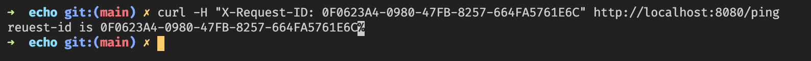

# example for gin

In some systems, the gateway (such as [ingress-nginx](https://kubernetes.github.io/ingress-nginx/user-guide/nginx-configuration/configmap/#generate-request-id)) will send a The http header field of X-Request-ID, we hope that each line of the log printed by processing the request can print the x-request-id field together.
The following example is the best practice for using klog with the gin framework.We choose to read the X-Request-ID field in the middleware and ensure that the request-id field can be obtained normally in subsequent functions.

    package main

    import (
        "context"
        "fmt"
        "net/http"

        "github.com/gin-gonic/gin"
        log "github.com/kunstack/klog"
    )

    // Do some operations...
    func someService(ctx context.Context) {
        l := log.FromContext(ctx)
        defer l.Flush()
        l.Warningln("this is someService...")
    }

    func main() {
        router := gin.Default()

        router.Use(func(ctx *gin.Context) {
            newCtx := log.WithContext(
                ctx.Request.Context(),
                log.StrField("request-id", ctx.Request.Header.Get("x-request-id")),
            )
            ctx.Request = ctx.Request.WithContext(newCtx)
        })

        router.GET("/ping", func(ctx *gin.Context) {
            l := log.FromContext(ctx.Request.Context())
            defer l.Flush()
            l.Infoln("this is test message")
            someService(ctx.Request.Context())
            ctx.String(http.StatusOK, fmt.Sprintf("reuest-id is %s", l.Fields().Get("request-id")))
        })

        router.Run(":8080")
    }

Some gateways will help us generate X-Request-ID, if you need to test manually, you can try the following curl command

    curl -H "X-Request-ID: 0F0623A4-0980-47FB-8257-664FA5761E6C" http://localhost:8080/ping

operation result,The corresponding request-id printed in each log line:

The result of running the curl command

